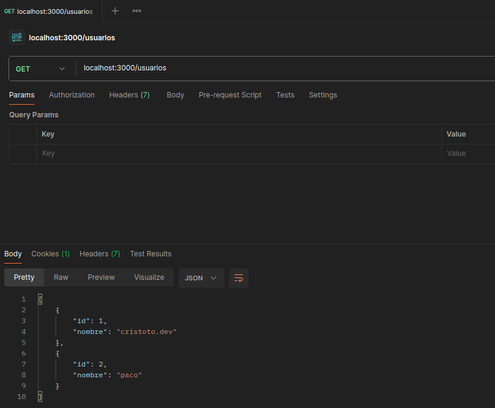

# Express.js: Un marco de trabajo minimalista y flexible para Node.js

## ¿Qué es Express?

[Express](https://expressjs.com/) es una herramienta sencilla diseñada para Node.js, que ofrece un conjunto completo de funciones para crear aplicaciones web y móviles. Con él, puedes desarrollar aplicaciones de una sola página, multipágina o híbridas, además de APIs para clientes web o móviles. Destaca por su facilidad de uso y capacidad de adaptación, lo que lo convierte en la elección perfecta para desarrolladores que buscan una solución ágil y adaptable para sus proyectos.

## ¿Para qué podemos usarlo?

Se utiliza para construir aplicaciones web y APIs de manera eficiente. Puede manejar solicitudes HTTP, definir rutas, servir archivos estáticos, y mucho más. Express es compatible con una amplia gama de motores de plantillas y middleware, lo que permite una gran flexibilidad en la construcción de aplicaciones.

## Request y Response

En Express, cada solicitud HTTP se maneja a través de una función de callback que tiene acceso a los objetos `req` (request) y `res` (response). El objeto `req` representa la solicitud HTTP entrante y contiene información sobre la solicitud, como parámetros, cuerpo, y encabezados HTTP. El objeto `res` se utiliza para enviar una respuesta al cliente. Por ejemplo, `res.send('Hola Mundo!')` envía una respuesta con el texto "Hola Mundo!" al cliente.

## Requisitos

Para comenzar a desarrollar con Express, necesitas tener Node.js y npm instalados en tu máquina. Puedes verificar si están instalados correctamente ejecutando `node --version` y `npm --version` en tu terminal. Si ves los números de versión, significa que tienes Node.js y npm instalados correctamente.

## Instalación

```bash
npm install
```

## Uso

Por defecto el servidor está corriendo en el puerto 3000

```bash
npm run start
```

## Ejemplo de peticiones HTTP para usar la API

### Método GET (Obtener usuarios)



### Método POST (Crear usuario)

.png>)

### Método PUT (Editar usuario)

.png>)

### Método DELETE (Eliminar usuario)

.png>)

## Contribución

¡Las contribuciones son bienvenidas! Si encuentra algún problema o tiene alguna sugerencia, no dude en abrir un problema o enviar un PR.
